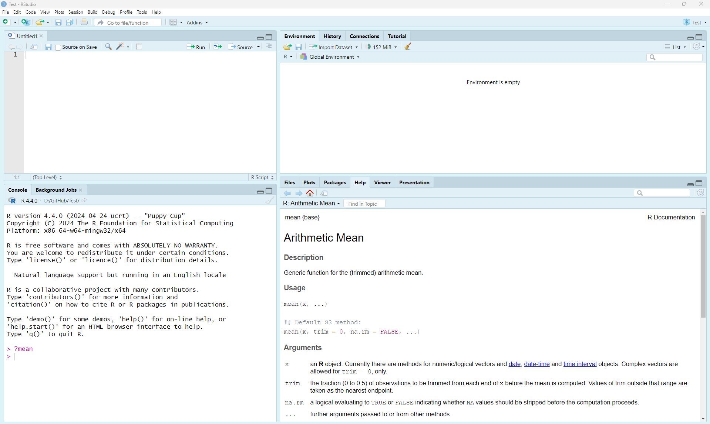
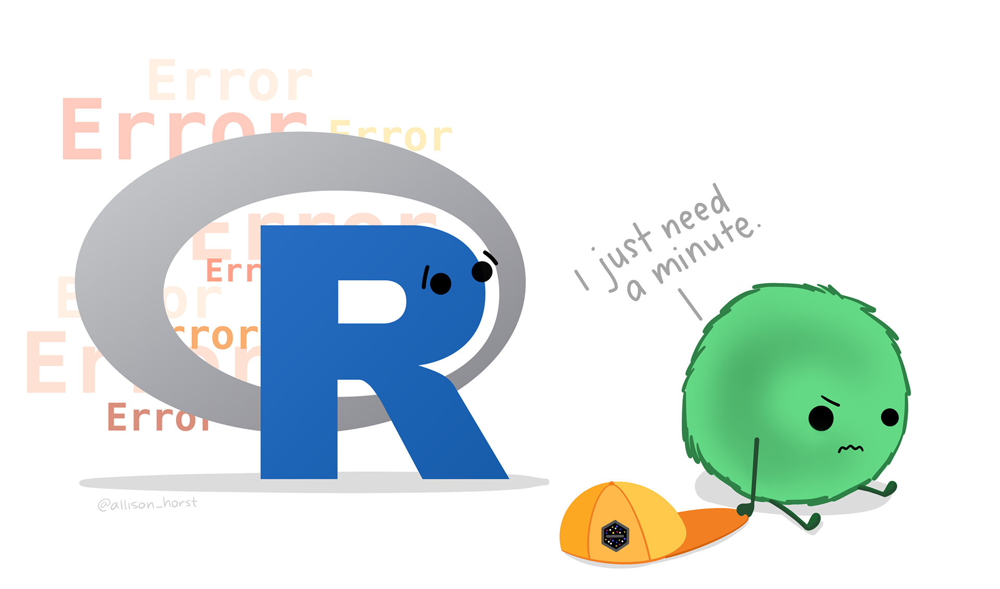
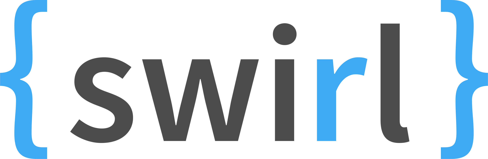

# Guide 2: Introduction to R

!!! tip "A Compilation of Resources"
    This guide is a compilation of material developed by various Smithsonian researchers. Many thanks to all for sharing their code and knowledge in courses being taught at the Smithsonian-Mason School of Conservation (SMSC). Also included is material from workflows developed by the National Center for Ecological Analysis and Synthesis (NCEAS) of the University of California - Santa Barbara. We encourage you to investigate the courses being taught at [SMSC](https://smconservation.gmu.edu/) and the resources available at [NCEAS](https://www.nceas.ucsb.edu/learning-hub).

## Introduction
[R](https://cran.r-project.org/) is a powerful statistical programming language that is used broadly by researchers around the world. Among the reasons to use [R](https://cran.r-project.org/) include:

1. Free and open source!
2. Runs on a variety of platforms including Windows, Unix and MacOS.
3. An unparalleled platform for programming new statistical methods in an easy and straightforward manner.
4. Contains advanced statistical routines not yet available in other software.
5. New add-on “packages” are being created and updated constantly.
6. State-of-the-art graphics capabilities.

[R](https://cran.r-project.org/) does have a steep learning curve that can often be intimidating to new users, particularly those without prior coding experience. While this can be very frustrating in the initial stages, learning [R](https://cran.r-project.org/) is like learning a language where proficiency requires practice and continual use of the program.

### Installing R and R-Studio

[R](https://cran.r-project.org/) is available for Linux, MacOS X, and Windows (95 or later) platforms. Software can be downloaded from one of the Comprehensive R Archive Network (CRAN) mirror sites. It’s best to choose the [R](https://cran.r-project.org/) mirror that is closest to your location. Once installed, [R](https://cran.r-project.org/) will open a console where you run code. You can also work on a script file (preferred), where you can write and (importantly) save your work.

[R-Studio](https://posit.co/download/rstudio-desktop) is an enterprise-ready professional software tool that integrates with [R](https://cran.r-project.org/). This integrated development environment (IDE) has some nice features beyond the normal R interface.


### R-Studio IDE

[R-Studio](https://posit.co/download/rstudio-desktop) has four separate panels to organize your workflow and project. The entire interface is customizable, including fonts and colors of the text and background (see Customizing [R-Studio](https://posit.co/download/rstudio-desktop)). The four panels are:

- Source (code) Editor (upper left)
- Console (lower left) where your code is executed
- Environment/History (upper right)
- Files/Plots/Packages/Help (lower left)

### Getting Help

One of the most useful and important commands in [R](https://cran.r-project.org/) is `?`. All [R](https://cran.r-project.org/) functions should have an associated help file. At the command prompt (signified by `>` in your Console window), type `?` followed by any command and you will be prompted with a help tab for that command (e.g., `?mean` or `help(mean)`). Note, you can also search through the help tab directly by searching functions on the search bar.

Various blogs, mailing lists, and websites (e.g., https://stackoverflow.com/) are dedicated to providing information about [R](https://cran.r-project.org/), its packages, and potential error messages that you may encounter (among other things). The trick is usually determining the key terms to limit your search. 

Note that it’s important to read the error messages that [R](https://cran.r-project.org/) provides. These messages help understand when you have typed something that the computer doesn’t understand. 

*Artwork by [Allison Horst](https://allisonhorst.com/allison-horst)

## Basic R Concepts

There are a few concepts that are important to keep in mind before you start coding. The fact that [R](https://cran.r-project.org/) is a programming language may deter some users who think “I can’t program”. This should not be the case for two reasons. First, [R](https://cran.r-project.org/) is an interpreted language, not a compiled one, meaning that all commands typed on the keyboard are directly executed without requiring you to build a complete program like many other computer languages (e.g., C, Pascal). Second, [R](https://cran.r-project.org/)’s syntax is very simple and intuitive. For instance, a linear regression can be done with the command `lm(y ~ x)` which means fitting a linear model with `y` as the response and `x` as a predictor. 

In [R](https://cran.r-project.org/), we need to send a command to the “prompt” for the command to be executed. A greater than sign (`>`) in the console indicates that [R](https://cran.r-project.org/) is ready to accept commands. Functions always need to be written with parentheses, even if there is nothing within the parentheses (e.g., `ls()` instead of `ls`). If you type the name of a function without parentheses, [R](https://cran.r-project.org/) will display the content of the function. See what happens when typing `ls` instead of `ls()` in the Console.

Variables, data, functions, results, are stored in active memory in the form of objects that you assign with a name (`x = c(1,2,3)`). The user can then execute actions on these objects with operators (arithmetic, logical, comparison) and functions (e.g., `x + 3`). We can send and work directly in the console, or much better, we can **create a script** so that we can edit the code and re-run the analysis in the future. 

### Naming Conventions

The name of an object must start with a letter (A-Z or a-z) and can be followed by letters, digits (0-9), dots (.), and underscores (_). Do not include spaces. It is also important to note that [R](https://cran.r-project.org/) discriminates between uppercase and lowercase letters in the names of objects, so that `x` and `X` can name two distinct objects.

In addition to commenting your code, there are best practices to help make your code more readable. This includes using appropriate naming conventions, such as **snake case** or **Camel Case**:

- some_use_snake_case
- SomePreferCamelCase

Choosing a naming convention is a personal preference. Most important is to choose a format and be consistent! You (and your collaborators) will thank you for it.

!!! note "Be careful with forward and back slashes"
    When referring to the directory of a folder or a data file, [R](https://cran.r-project.org/) uses forward slash “/”. You need to pay close attention to the direction of the slash if you copy a file path or directory from a Windows machine.

## Starting R - Setting your working directory

## R Fundamentals

### Data Types

There are four fundamental data types in R that you will work with:
1. Character: Data are string values (a word or sequence of words)
2. Numeric (also called double): Data are numbers that contain a decimal
3. Integer: Data are whole numbers (no decimal point)
4. Logical (also called boolean): Data that are either `TRUE`, `FALSE`, or `NA`

You can check the data type of an object using the function `class()` or using logical tests such as `is.numeric()`, `is.character()`, and `is.logical()`. To convert between data types you can use: `as.integer()`, `as.numeric()`, `as.logical()`, `as.character()`.

For instance:

```
city <- 'Nairobi'
class(city)

number <- 3
class(number)

Integer <- as.integer(number)
class(Integer)

double <- 56.2
class(double)
is.numeric(double)

logical <- 3 > 5
logical
```

### Assigning Date to objects

Since [R](https://cran.r-project.org/) is a programming language, we can store information as objects to avoid unnecessary repetition. To keep information in [R](https://cran.r-project.org/), we need to create an object. We can assign a value of a mathematical operation (and more) to an object in R using the assignment operator `<-` (greater than sign and minus sign). The general format for using the assignment operator in [R](https://cran.r-project.org/) is: `object_name <- value`. By doing so, we can re-use the object and use it in additional calculations.

!!! note "Objects stored in memory"
    After creating an object, [R](https://cran.r-project.org/) doesn’t print anything to the screen. We can force [R](https://cran.r-project.org/) to print the object by calling the object name (i.e., by typing it out) or by using parentheses. In addition, if we look at our Environment tab (upper right panel), we will see that the object has been stored in [R](https://cran.r-project.org/).

```
city <- "front royal"
city

(numbers <- c(1,3,5,12))
summary(numbers)
```

### Special Characters

The `#` character is used to add comments to your code. `#` indicates the beginning of a comment and everything after `#` on a line will be ignored and not run as code. Adding comments to your code is considered good practice because it allows you to describe in plain language (for yourself or others) what your code is doing.

You can also use the semicolon (;) so that you can write different commands on the same line of code.

```
# This is a comment

# Combining commands using ;
a <- 3; b <- 6; c <- a+b
a
b
c

# Multiple our numbers object by 3
numbers * 3
```

## Data Structures in R

## Other Resources: SWIRL

[R](https://cran.r-project.org/) packages are the building blocks of computational reproducibility in [R](https://cran.r-project.org/). Each package contains a set of related functions that enable you to more easily do a task or set of tasks in [R](https://cran.r-project.org/). There are thousands of community-maintained packages out there for just about every imaginable use of [R](https://cran.r-project.org/).

SWIRL is a user-generated program **package** (also called a **library**) for learning how to code in [R](https://cran.r-project.org/). To access the tutorial information, you must first install the package to make it accessible. In the Console window (bottom left), type the following and press ENTER:


```
install.packages("swirl")
```

This may take a little while, but when the stop sign in the upper right of the console window is gone, you can proceed. For any package you install in [R](https://cran.r-project.org/), you will also need to turn them on before using them. You can do this with the `require()` or `library()` functions. Type this now:

```
library(swirl)
```

**Note:** You may be prompted to select a “mirror” from which to download the package. If this is the case, it is recommended that you choose the mirror that is geographically closest to you.

To install the lesson, you will need to use:

```
install_from_swirl("R Programming")
```

*Find out more about other courses, and other download options here: [https://github.com/swirldev/swirl_courses](https://github.com/swirldev/swirl_courses)*

### SWIRL Lessons

There are many lessons within [R](https://cran.r-project.org/). Once SWIRL is loaded, you will be given the option of which lessons to complete. Some of the core lessons can be found in the initial section labeled R Programming. The estimated time to compete required lessons is about 2 hours. We recommend to start with the following lessons:

1. **Basic Building Blocks (10 min)**
2. **Workspace and Files (15 min)**
3. **Sequences of Numbers (5 min)**
4. **Vectors (8 min)**
5. **Missing Values (5 min)**
6. **Subsetting Vectors (12 min)**
7. **Matrices and Data Frames (13 min)**
8. Logic (optional)
9. **Functions (30 min)**
10. lapply and sapply (optional)
11. vapply and tapply (optional)
12. **Looking at Data (5 min)**
13. Simulation (optional)
14. Dates and Times (10 min) (optional)
15. **Base Graphics (10 Min)**

### Run SWIRL

Type the following to begin using SWIRL. Also, when restarting your session later, you’ll need to “turn on” SWIRL each time with either `library(swirl)` or `require(swirl)`.

```
swirl()
```

**Have Fun!**
