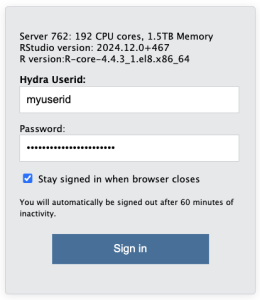
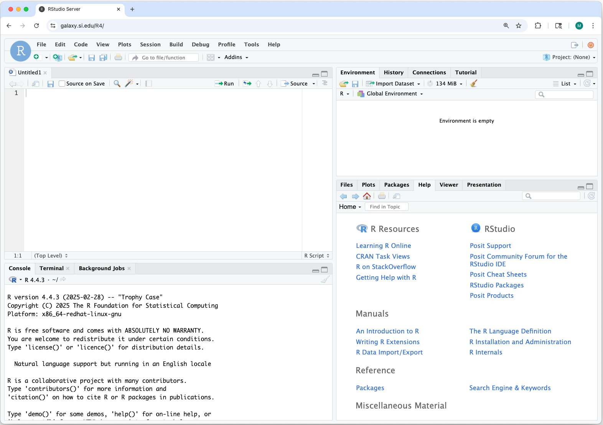
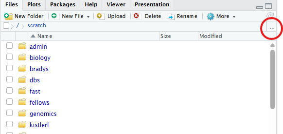
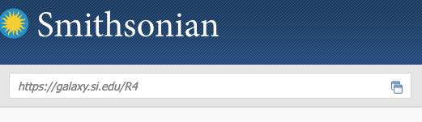
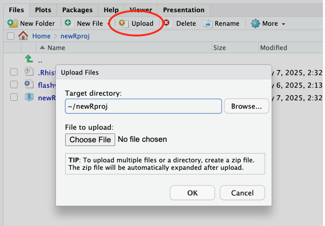
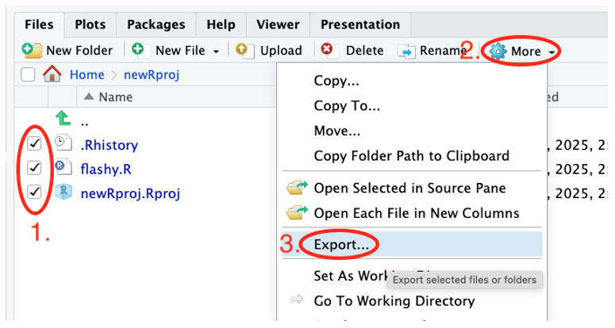
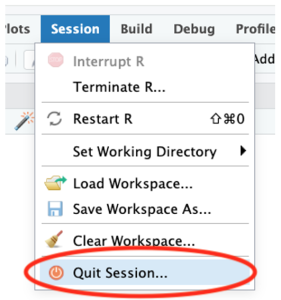

# Guide 4: Running R-Studio from Hydra

!!! tip "For the Most Up to Date Information"
    The information provided here is adapted from the Smithsonian guide on ["Using the R-Studio Server"](https://confluence.si.edu/spaces/HPC/pages/385975502/Using+the+RStudio+Server). Please refer to the source documentation for full instructions.
	
Hydra offers a dedicated [R-Studio](https://posit.co/download/rstudio-desktop) Server for interactive running of [R](https://cran.r-project.org/)-based workflows using a familiar GUI.

Users can leverage this server to test, debug, and develop [R](https://cran.r-project.org/) based workflows using the interactive R-Studio GUI (currently running R 4.5.2). By logging in with your Hydra account credentials, you will have access to the storage under `/data`, `/scratch` and `/store`.

## Getting Started

The [R-Studio](https://posit.co/download/rstudio-desktop) environment is accessible directly via a browser at [https://galaxy.si.edu/R4](https://galaxy.si.edu/R4).

Just like the other components of Hydra, this server is only accessible from computers connected to Smithsonian networks (i.e., VPN, [telework.si.edu](https://telework.si.edu), or on-site networks), not on the public internet. Instructions for remote access are provided below in [Remote Access](#remote-access).

1. Open [https://galaxy.si.edu/R4](https://galaxy.si.edu/R4) in a browser on a computer that has access to Hydra.
2. Log in with your Hydra username (all lowercase) and password.

3. A web-based interface to a [R-Studio](https://posit.co/download/rstudio-desktop) session running on the server opens. The interface is nearly identical to what you would use on your workstation.
You can install packages, run scripts, and create [R](https://cran.r-project.org/) projects in the same way as you would on your workstation. 

4. The "Files" tab shows Hydra's storage systems. You have access to Hydra's `/home`, `/scratch`, `/data`, and `/store` directories. You can use the [R-Studio](https://posit.co/download/rstudio-desktop) Server interface to transfer files or use other file transfer tools.

5. All computations are performed on the dedicated server. If you close the browser window, your R session continues so objects in memory are preserved and computations will continue. 

## Software specifications

The instance is running:

- R 4.5.2
- RStudio Server 2024.12.0+467

The version of [R](https://cran.r-project.org/) and [R-Studio](https://posit.co/download/rstudio-desktop) Server is the same for all users. 

## Hardware specifications

The dedicated R-Studio Server node has:

- 192 CPU cores
- 1.5 TB of memory

Be mindful that the [R-Studio](https://posit.co/download/rstudio-desktop) Server is a shared resource. Please terminate idle [R](https://cran.r-project.org/) sessions to free up memory for other users when not in use.

## Remote access

The [R-Studio](https://posit.co/download/rstudio-desktop) Server can be accessed directly from your browser if your computer has a VPN enabled to access Hydra. The Smithsonian Telework website - [https://telework.si.edu](https://telework.si.edu) - can also be used to access Hydra without a VPN. To do so:

1. Log into:  
[https://telework.si.edu](https://telework.si.edu)

2. In the text box in the top left of the window, under the Smithsonian logo, labeled "Enter an internal resource" enter:  
[https://galaxy.si.edu/R4](https://galaxy.si.edu/R4)  
and then press the enter/return key.

3. The [R-Studio](https://posit.co/download/rstudio-desktop) Server login page will open in the same way as if you were onsite.

## R-Studio Server vs R Workstation
	
Using [R-Studio](https://posit.co/download/rstudio-desktop) Server is nearly identical to running the standard workstation version of [R-Studio](https://posit.co/download/rstudio-desktop). However, some key differences exist:

1. File transfer
Your data must be transferred to/from Hydra to work on it - directories in `/home`, `/data`, and `/scratch` are all available on this server. Note: `/store` is not available at this time. The Hydra storage guidance, quotas, and scrubber policies apply to data used through the dedicated [R-Studio](https://posit.co/download/rstudio-desktop) Server. 

In addition to the existing file transfer tools for Hydra (see the [file transfer guide](https://confluence.si.edu/spaces/HPC/pages/163152227/Transferring+Files+to+from+Hydra), [quick start guide](https://confluence.si.edu/spaces/HPC/pages/163152218/Quick+Start+Guide), and [Globus](https://smithsonian.github.io/globus-docs/)), [R-Studio](https://posit.co/download/rstudio-desktop) Server has built-in tools for file transfers. These built-in tools are best for small files or quick edits. For large files or large file sets consider other file transfer tools.

**Using [R-Studio](https://posit.co/download/rstudio-desktop) Server's built-in tools**

- **Upload** from your computer to Hydra: use the “Upload” button in the Files tag

	- Only one file can be uploaded at a time. Create a zip archive on your computer to upload several files at once. [R-Studio](https://posit.co/download/rstudio-desktop) Server will unzip them automatically when they’re received.

- **Download** from Hydra to your computer
	- Select the checkboxes for files and folders you want to download.
	- Click the “More” button.
	- Choose “Export…”
	
	- In the pop-up window click the Download button to save to your computer. If multiple files or a folder was selected, it will be zipped automatically prior to download.
	

2. [R](https://cran.r-project.org/) Session
Your [R](https://cran.r-project.org/) session will continue to run on the server when you close your browser window or log off your computer. Any analyses underway will continue and your memory will be preserved. To re-connect to your R session, log back in to the RStudio Server. This will work even if you log back on from a different computer. This allows you to start a long analysis on the server and then disconnect.

**Ending your [R](https://cran.r-project.org/) Session**
When you have completed your work on the [R-Studio](https://posit.co/download/rstudio-desktop) Server, please quit your [R](https://cran.r-project.org/) session to free resources for other users.

Use “Quit Session...” from the Session or File menu.

**One [R](https://cran.r-project.org/) Session limit**
[R-Studio](https://posit.co/download/rstudio-desktop) Server only allows one [R](https://cran.r-project.org/) session per user. This means that if you have an existing session and log in to the server via a browser, control of that session will switch to the current browser. There is not a way to have more than one browser window open with different RStudio and R sessions.

## Additional Information