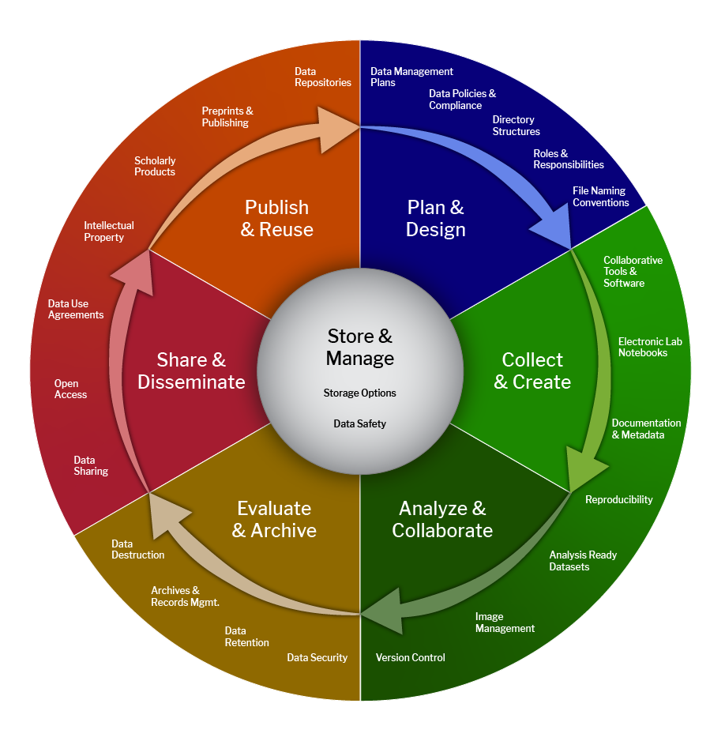

## Introduction

The term data management can mean different things to different people depending on their role and responsibilities. From an organizational perspective, however, these varied functions are interconnected and form a continuous, repeating workflow known as the data management lifecycle. While organizations and institutions may define the lifecycle differently, most frameworks share a common set of stages that guide data from planning and collection through analysis, preservation, and reuse.

The lifecycle presented here builds on concepts developed by the U.S. Geological Survey ([USGS](https://www.usgs.gov/data-management/data-lifecycle)) and the [Harvard Business School](https://online.hbs.edu/blog/post/data-life-cycle). For readers interested in a more detailed and research-focused framework, we also recommend reviewing the [Harvard Biomedical Data Lifecycle](https://datamanagement.hms.harvard.edu/plan-design/biomedical-data-lifecycle), shown here:

## Step 1- Plan

Before starting any project, it's important to take time to think through your data workflow and plan how your data will be managed throughout the project's lifecycle. Planning data workflows in advance can help prevent mistakes, save time and resources, and reduce unnecessary challenges.

A best practice is to document these plans in a living document that is shared with all members of your team. The NZCBI data community plans to develop more specific guidance on this topic in the future. In the meantime, we recommend reviewing this [USGS resource page](https://www.usgs.gov/data-management/data-management-plans) for more information.

## Step 2- Generation

From direct field observations and expanding networks of remote sensors to cutting-edge laboratory recordings, NZCBI researchers routinely generate the raw data that underpin downstream analyses. Because we collect much of these data ourselves, our teams have direct control over key aspects of data generation, including:

* Measurement unit
* Resolution
* Recording frequency\*
* File format

This level of control makes it essential to design survey and observation protocols with downstream applications in mind. Decisions made during data collection can affect not only the success of the current project but also the future value and reusability of the data for other research efforts.

Researchers also control the metadata that accompany primary observations. This contextual information can be just as important as the observations themselves, helping others understand, interpret, and reuse the data. As a result, metadata should be planned and documented with the same level of care given to primary data collection.

One of the key topics discussed during the initial Data Technology Workshop was the development of unit-wide metadata standards. As those standards and supporting materials are developed, updates will be shared with the broader team.

\*Depending on the capabilities and configuration of the observation instrument, it may be necessary to distinguish between observing and collecting data. In some cases, data may be recorded initially but filtered or discarded before being stored for downstream use.

## Step 3- Acquire

Not all data our teams use will be generated in-house, some will need to come from external sources.

These datasets can be:

* publicly available
* provided by established partners
* requested from restricted sources

Each will come with their own set of access/use restrictions and citation requirements that need to be respected and recorded. This is necessary for both the initial project and if the dataset (or derivatives of it) are stored on SI servers for potential future work. When selecting datasets to acquire it is also essential that the data gathering methods be properly evaluated in the context of the parameters and metadata standards considered in Step 2.

If the data being acquired is not publicly available, the data creators will often require a data sharing agreement be signed before providing the data. Signing such agreements should be completed with approval from the SI legal team so plan ahead for the time required for that approval.

## Step 4 – Storage

Data storage begins as soon as it arrives on SI computers and continues through to identifying an appropriate archival location. Teams should also ensure accurate and secure transfer of data between location. This step can also include some processing actions like data compression and data encryption for efficient and secure storage.

Important considerations here include

* file name nomenclature
* folder organization
* storage cost
* security/accessibility (including appropriate user levels for sensitive data)
* back up redundancy (while also avoiding unstructured file duplication)

More details on this step can be found in our [Data Managment Guide](https://github.com/Smithsonian/NZCBI-DataComputingDocs/blob/main/docs/data-management.md)

## Step 5 -Processing

Regardless of data source, our teams will regularly need to wrangle/manipulate that data for downstream use. Types of manipulation include

* cleaning
* formatting
* validating
* summarizing
* transforming
* integrating
* subsetting

These actions need to be carefully recorded, again for both the initial project and if the dataset (or derivatives of it) are stored on SI servers for potential future work. Some data sets will only require a one-time processing step and therefore a simple static documentation. Other standing datasets will need ongoing maintenance and therefore a more dynamic documentation system of change logs recording who changed what and when.

## Step 6-Analysis

With data in place and in the right format now our teams can finally address their research questions. This step includes whatever movement is required to get the data from the storage location to the analysis platform of choice; be it a local computer, a central SI resource like hydra, or an external cloud platform like Google Earth engine. As such it is important to again have a clear plan and record for where files are temporarily stored for analysis purposes.

These analyses will also produce their own data outcomes in the forms of results files that should recieve the same metadata considerations raw data production does in step 2 (e.g. data source, model parameters, analysis platform version) as well as the storage planning considerations discussed in step 4.

We can also include data visualization actions in this step. They require the same considerations of moving data to a place where it can be used by the visualization platform and creating outcome products like figures and maps that need to be stored in an organized way and tracked with a clear record of what data was used to build them.

## Step 7 – Interpret

This step refers to a sharing action where our teams provide context for the data or analysis outputs. For the NZCBI community the most common form of this will be writing scientific journal articles. These publications should clearly state in their text the major points of data creation, acquisition (including appropriate citations), processing, and analysis.

Other interpretive products like public presentations and info sheets may not require this level of detail directly in the product itself and, as such, the files for these products should be stored and recorded like the figures in the steps above; in an organized way and with a clear record of what data and analyses were used to build them.

Special consideration should be made for web platforms like ESRI StoryMaps and R Shiny Apps as, for the most part, this will require data to be stored in an accessible location separate from the primary archive location.

## Step 8- Share

This step refers to the direct sharing of data without interpretation. Key considerations here include:

* what platform the data will be available through
* tagging the data for discoverability
* setting data use restrictions
* establishing an identifier or otherwise a method for citation
* setting access restrictions if the data is sensitive (including a method for requesting access if appropriate)

In cases where the data is not directly publicly available teams may want to establish their own data sharing agreements. As with signing external agreement, building our own should be done in conjunction with SI legal staff. This process was identified as a key area of interest at the initial Data Technology Workshops so look to this space in the future for a collection of data sharing agreement templates and examples.

## Conclusion

And now we have a dataset that some other team may acquire and process in their own way to analyze a different question leading to a new shared output product and the cycle can loop on continuously.

