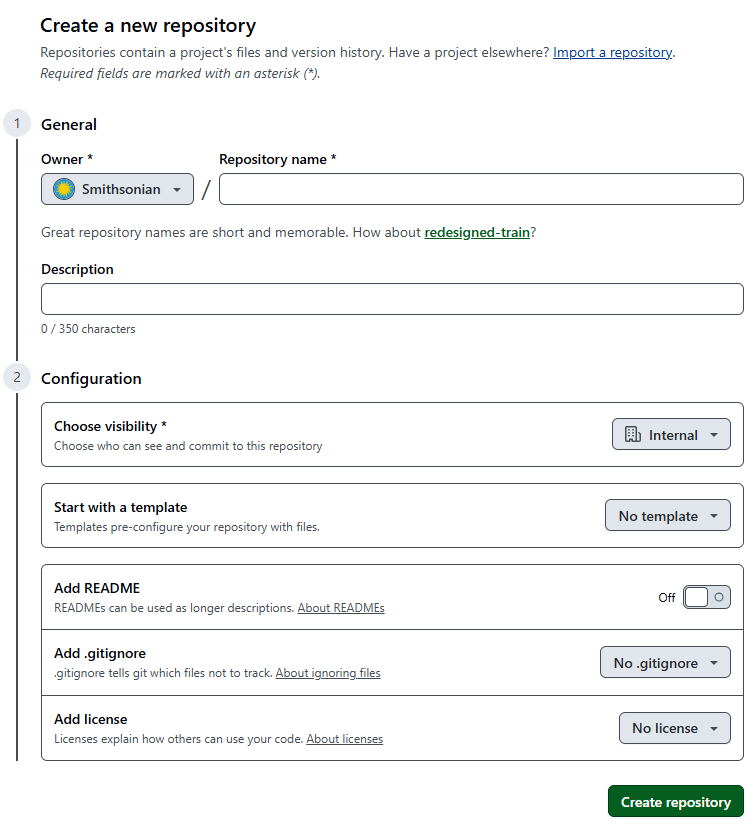
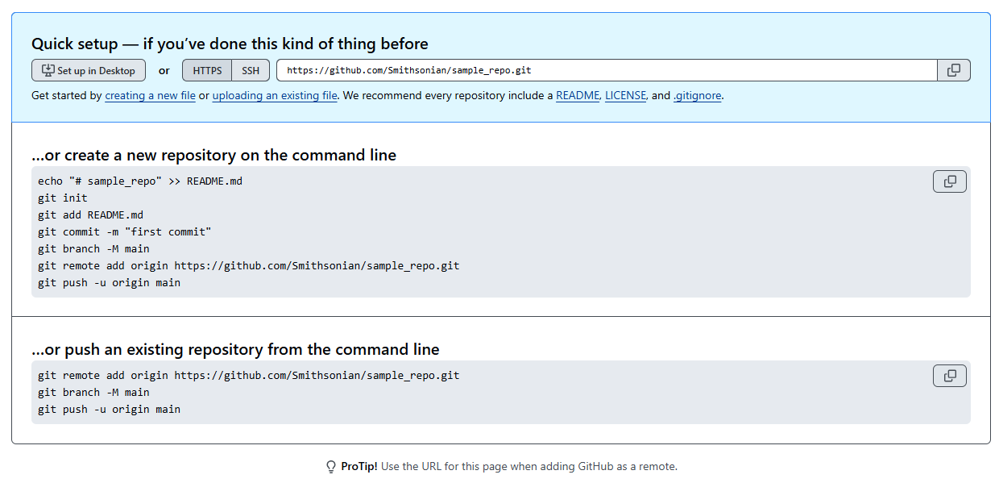

## Git and GitHub

**Git** is a version control system that tracks changes to collections of files over time, so you can see what changed, revert mistakes, and have multiple people work on the same project without overwriting each other. **GitHub** is a cloud platform that hosts Git projects remotely, giving teams a shared home for their code along with tools for collaboration and access control.

!!! tip "Carpentries Workshop: GitHub Without the Command Line"
    If you are interested in learning more about how GitHub works in a hands-on fashion, the Smithsonian Carpentries group often teaches its own lesson on "GitHub Without the Command Line". It can be found here: [https://miketrizna.github.io/github-without-command-line/](https://miketrizna.github.io/github-without-command-line/), and it is in the process of being ported to the Carpentries Incubator system.

## Creating a repository on the GitHub website

Whether you are starting a brand new project, or you are trying to share an existing collection of scripts and documentation, you will want to create a repository on GitHub. A **repository** (often shortened to "repo") is how you decided to organize and share a collection of files along with the full history of changes made to them.

To create a new repository, navigate to [https://github.com/new](https://github.com/new) in the web browser or click on the big "+" button at the top of any page on the GitHub web site.

Choose "Smithsonian" under the "Owner" dropdown to store the repository under the Smithsonian organization. The Smithsonian has an enterprise license, which enables a lot of special features including team and access management.

One of those enterprise features is the ability to set "Visibility" to Internal -- which simplifies sharing by making this repository visible to any GitHub member who is part of the Smithsonian organization.

If you are using this repository to store data that is already in place on Hydra or another computer, it is best to leave "README", ".gitignore", and "License" empty for now -- because those options will all create files in the repositories that will have to be harmonized with the other directory. It's easiest to start with a blank slate, and come back later to add these.

Click the big green "Create repository" button at the bottom to create the repository.

## Connecting the repository 

If you left "README", ".gitignore", and "License" empty, then your blank repository will be created along with helpful instructions on how to connect this GitHub repository with a collection of files on Hydra or another computer.

